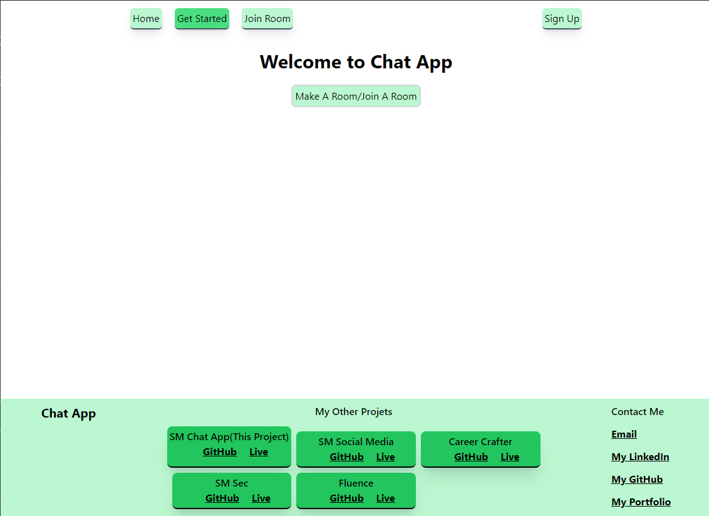

# Chat Application

A real-time chat application with authentication and responsive design.

## Key Features
- Real-time messaging using Socket.io
- User authentication with Firebase
- Responsive design with Tailwind CSS
- Deployed on Netlify (frontend) and Render (backend)

## Short Description
This web application is a real-time chat platform built with modern web technologies. The frontend is developed using React.js with TypeScript and styled using Tailwind CSS for a sleek and responsive user interface. Firebase handles user authentication, ensuring secure and efficient login and registration processes. The backend, created with Express.js and Socket.io, supports real-time messaging between users. The application is deployed with the frontend on Netlify and the backend on Render, providing a seamless and robust chat experience.

## Demo

## Tech Used
- **Frontend:** React.js (TypeScript), Tailwind CSS, Firebase (Auth)
- **Backend:** Express.js, Socket.io
- **Deployment:** Netlify (frontend), Render (backend)

## How to Use
1. Clone the repository: `git clone https://github.com/sarthakmishraa/sm-chat-app.git`